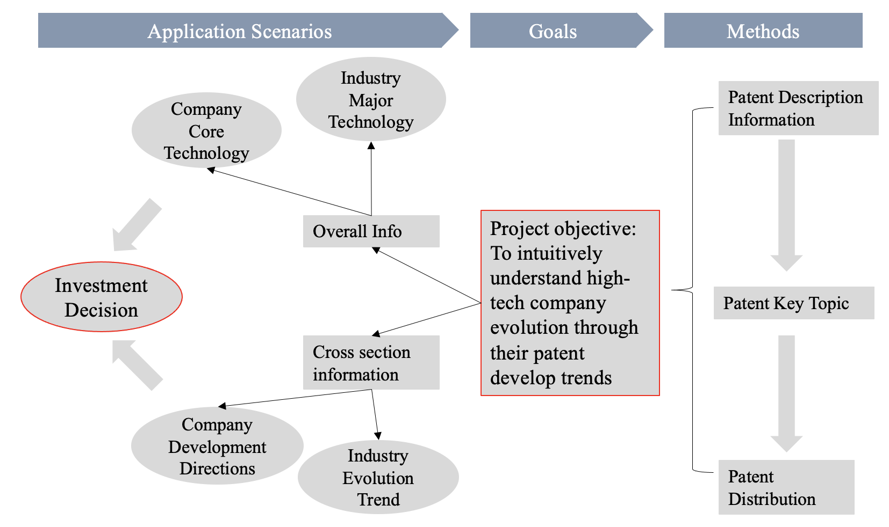
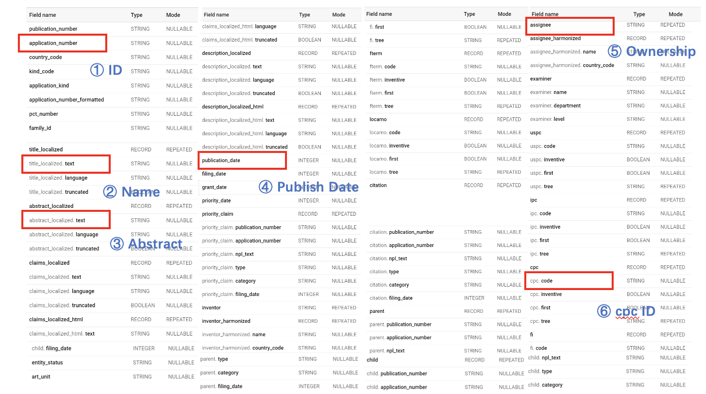
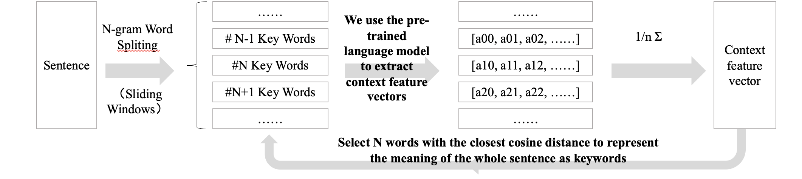
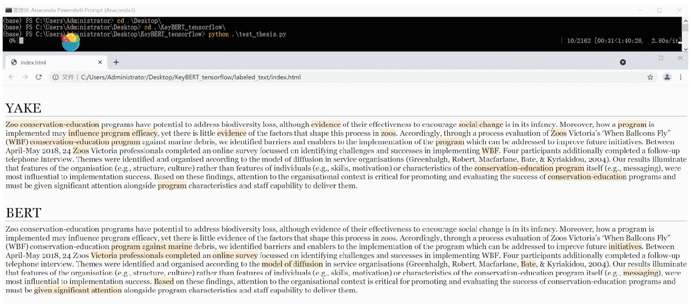
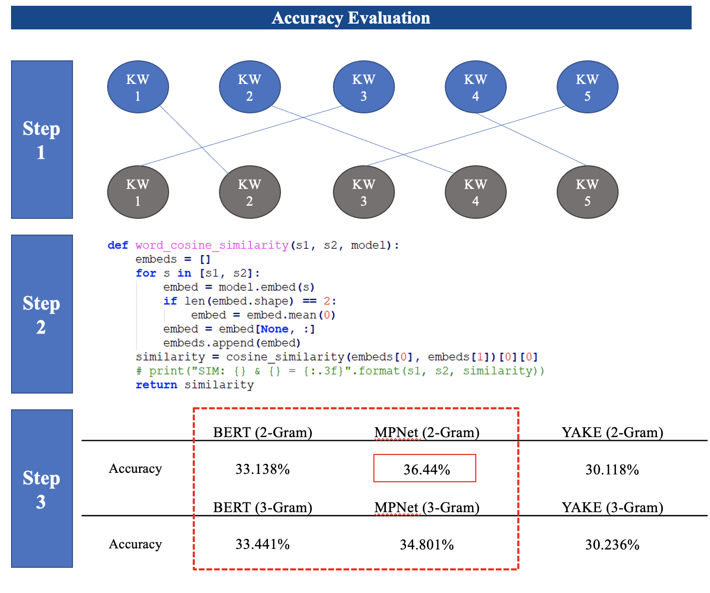
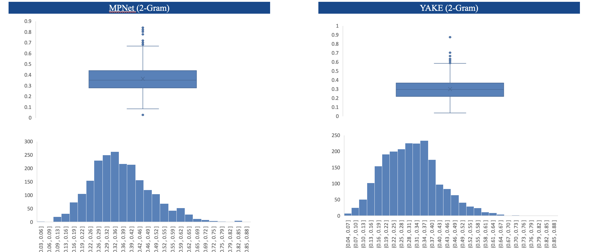
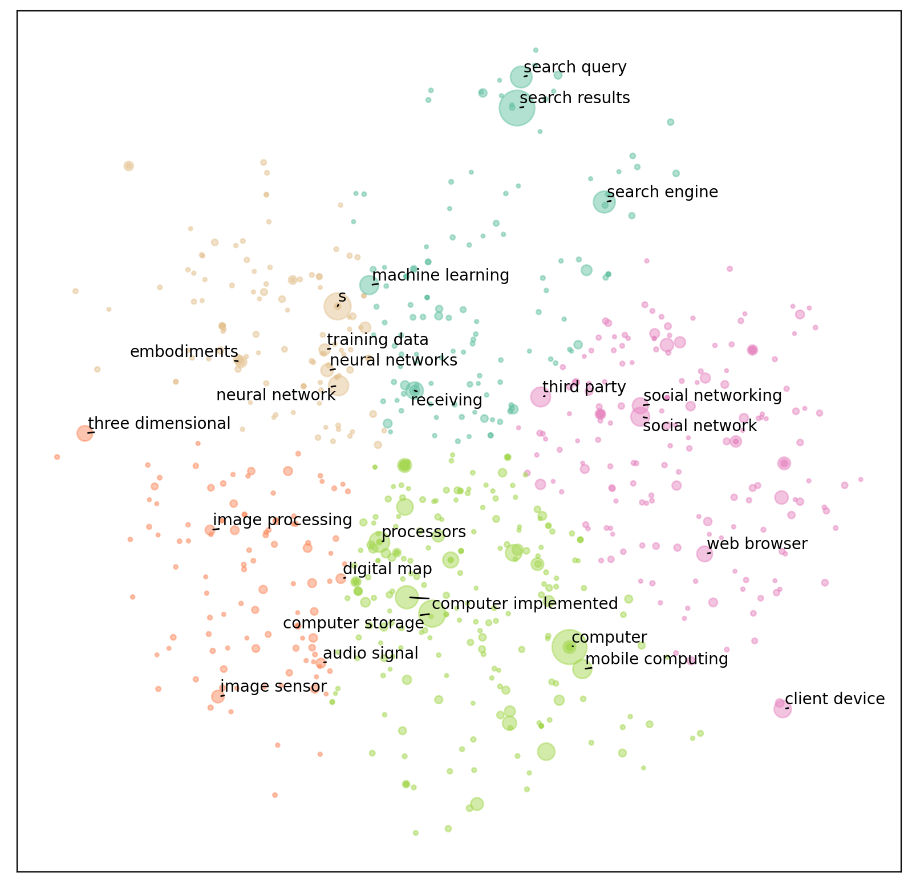
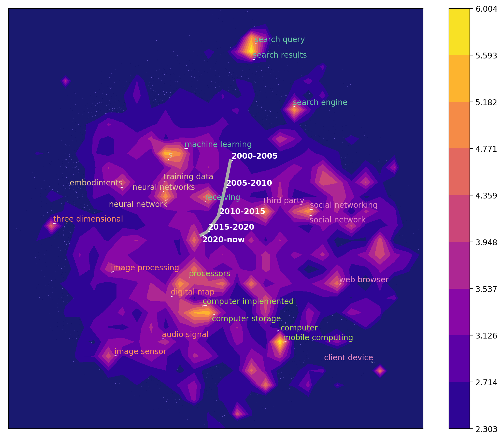

# Discovery of investment opportunities in high-tech industries based on patent information

*Author: [PENG Feng](mailto:pengf@stu.pku.edu.cn), JIANG Yifan*

**Attention**: the project was originally written in python and integrated into [a .ipynb file](main.ipynb). You can quickly run our project through this single file, or find more details about the project in other files.

Based on KeyBERT package: [MaartenGr/KeyBERT: Minimal keyword extraction with BERT (github.com)](https://github.com/MaartenGr/KeyBERT)

# Part I Objective

We want to find keywords that could embed the patents into a vertical high-dimensional space from the patent text data. Patents do not have their own keywords and the classification number is relatively general, so we want to extract keywords from the text by using word vectors.

We use Bert and MPNet's pre-training model and github's open source keyBert package.

# Part II DataSet
# 2.1 Data Source
## Patent Retriving Based on Google Big Query
Google BigQuery is Google's Cloud data warehousing solution that is part of the Google Cloud Platform. It is designed to deal with "big data" reporting, analytics and data science.

Using SQL queries, we can use BigQuery to do more in-depth statistical analysis, predictive analysis, and more than you can do in the Google Analytics interface.

# 2.2 Data Cleaning

Case 1: Data has been washed. The following method is the switch to read data and, if so, to read preprocessed data from the path.

Case 2: If no data is read, we do the following preprocessing steps and save the processed data.

Patent data contains multiple CSVS. We integrate them into one CSV and pickle for quick data loading.

# Part III Key Words
Key principles: approximation and additivity of word vector.

This paper introduces the idea of sentence average word vector approximation to sentence word vector, so as to find n words with maximum cosine similarity to sentence word vector as keywords, and take their cosine similarity as their importance degree.

Next, the abstracted text of patent data is used as the material to extract keywords.

# Part IV Accuracy Verification
Since papers and patent briefs have similar language styles and come with keywords, we can think of it as keyword tagged data.

We use the cleaned paper data as the material.

The average accuracy of extracted keywords was compared with YAKE, a rule-based rather than machine learning model with known good results.

Accuracy test results: the 2-gram MPNet model performed best

# Part V  Visualization
The purpose is to visually understand the distribution of patents through two-dimensional graphics

1. Reduce the patent word vector to 2 dimensions using PCA, merge the keywords of different patent abstracts according to the same word name, and add their importance as the importance of modified keywords in the company's overall patent group
2. Cluster keywords in two-dimensional coordinates, and manually tune the specific number of clusters
3. Visualize the four-dimensional data (X coordinate, Y coordinate, name, importance and classification) of each keyword

Output figure：.\data\plot 

